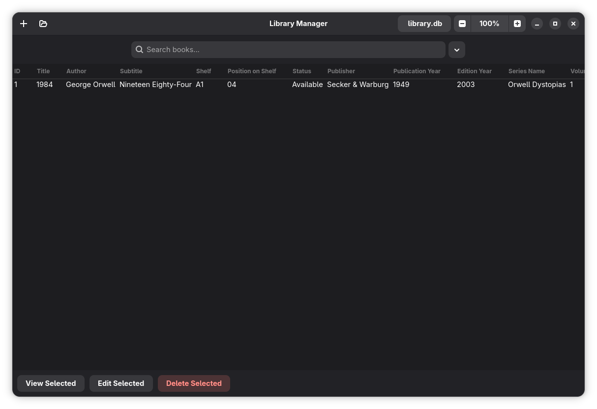
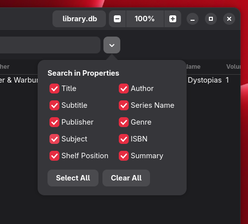
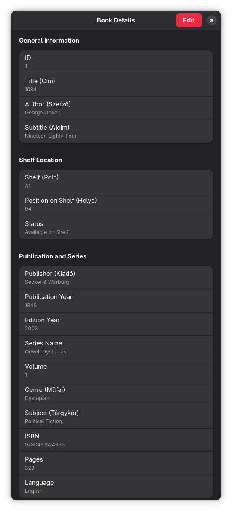
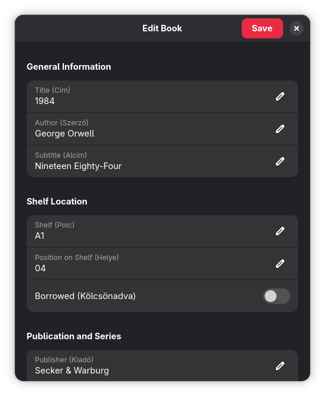

# Library-Manager
Simple GTK4 Library Manager app for Linux written entirely by AI
It currently only works on Linux and Windows but getting it to run on macOS is absolutely possible. 

## Screenshots

### Welcome Screen

### Main Interface

### Search Options

### Book Details

### Edit Book

